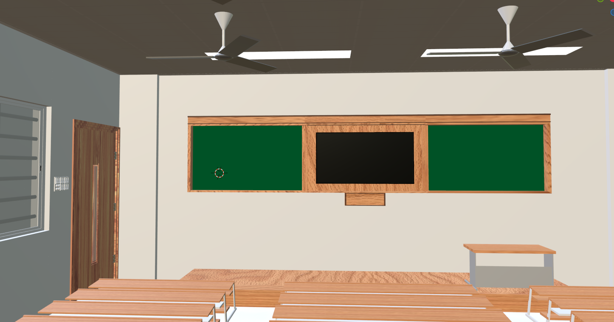
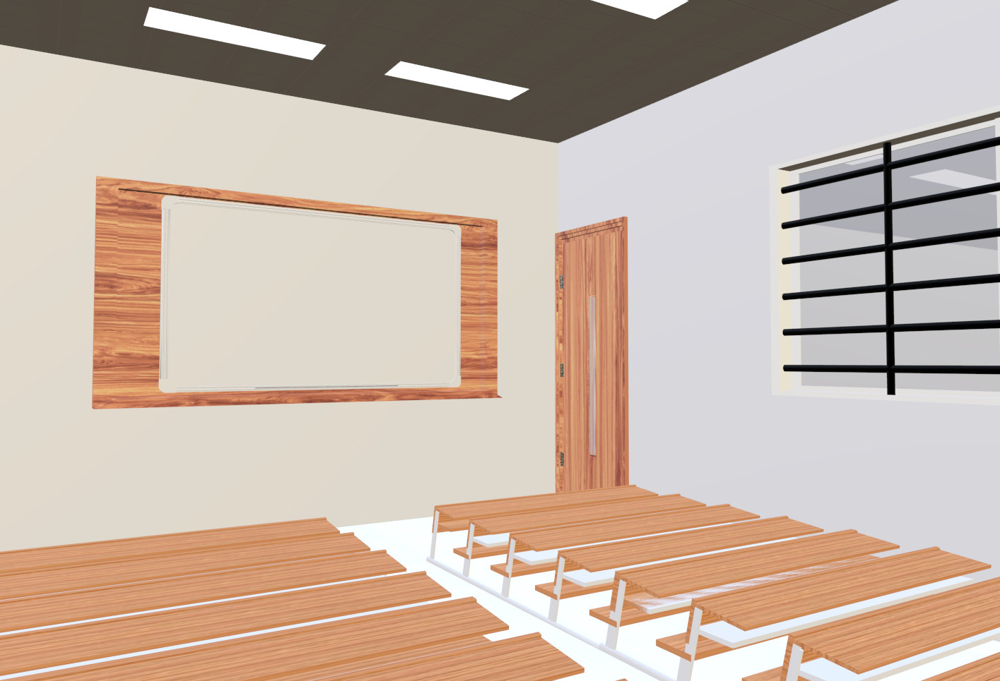
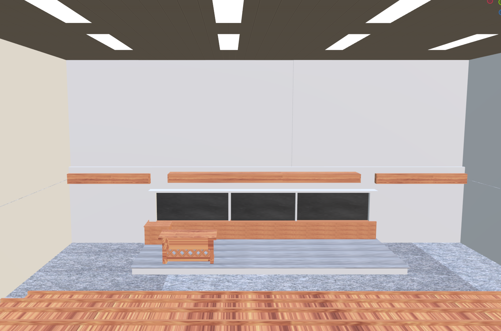
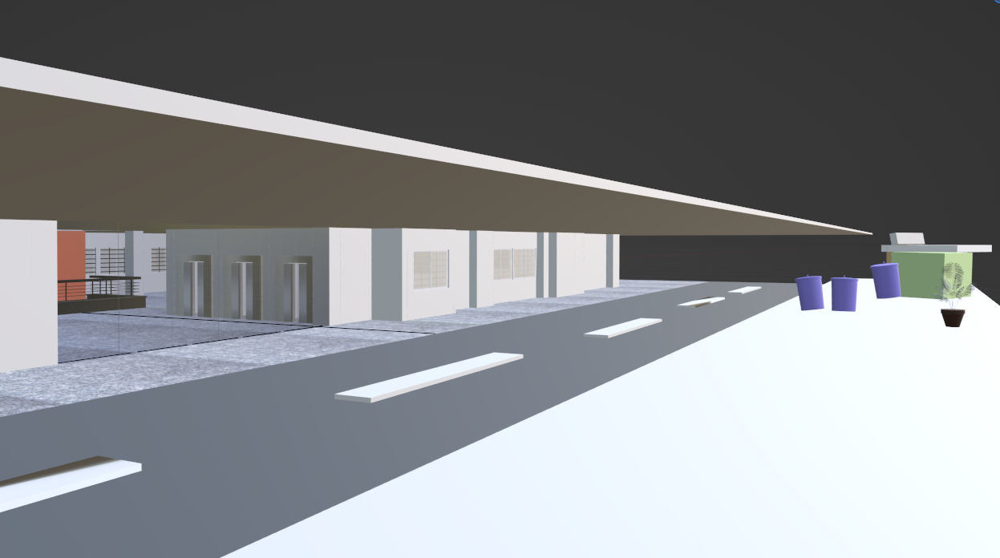
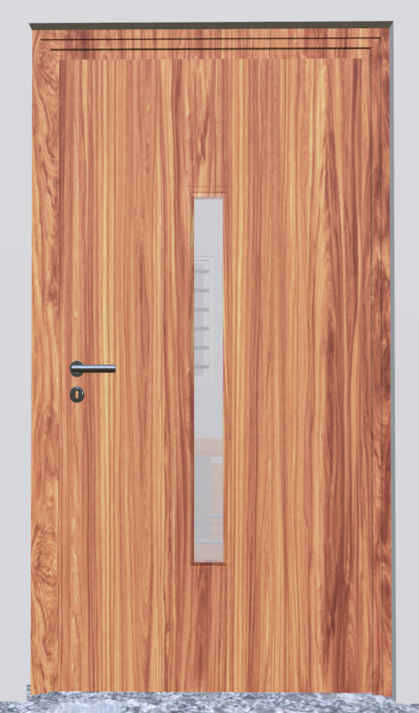
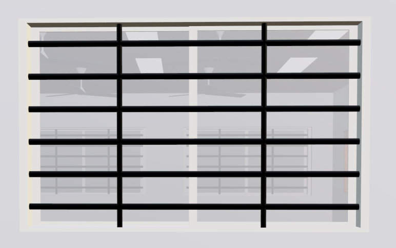
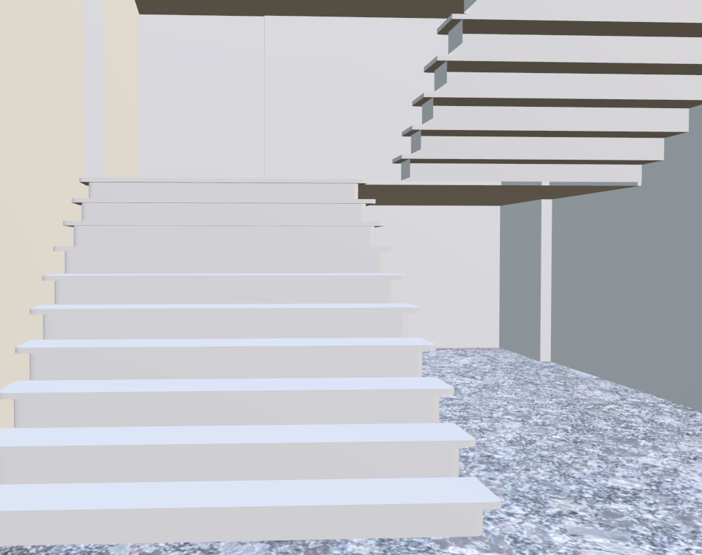

# Building Modelling

Building Modelling using [Blender](https://www.blender.org/) and [Unity](https://unity.com/). This is a project for our university course on Fundamentals of Augmented and Virtual Reality (UE20CS315).

### Images

**Classroom**

**Instruction Room**

**Seminar Hall**

**Block Entrance**

**Door**

**Window**

**Switchboard**

**Stairs**

### Objects

**Unique**

- [x] Front door
- [x] Shops
  - [x] Chips
- [x] Trees
- [ ] Pigeons
- [x] Stairs
- [x] Reception desk
  - [x] Blender Model
  - [ ] Interactive element
- [x] Glass wall
- [ ] Computer Lab
  - [x] Blender Model
  - [ ] Game

**Common**

- [x] Railings
- [x] Doors
- [x] Switch Board
- [x] Fans
- [x] Floor Tiles
  - [x] White Classroom Tiles
  - [x] Wood Classroom Tiles
  - [x] Black Granite Tiles
  - [x] Grey Granite Tiles
- [x] Ceiling Tiles
- [x] Benches
- [x] Boards
- [x] Windows
- [x] Grills
- [ ] Balcony
- [x] TV
  - [x] Blender Model
  - [ ] Interactive element
- [ ] Projectors
- [ ] Computers/Laptops
- [ ] Cables
- [x] Lights
